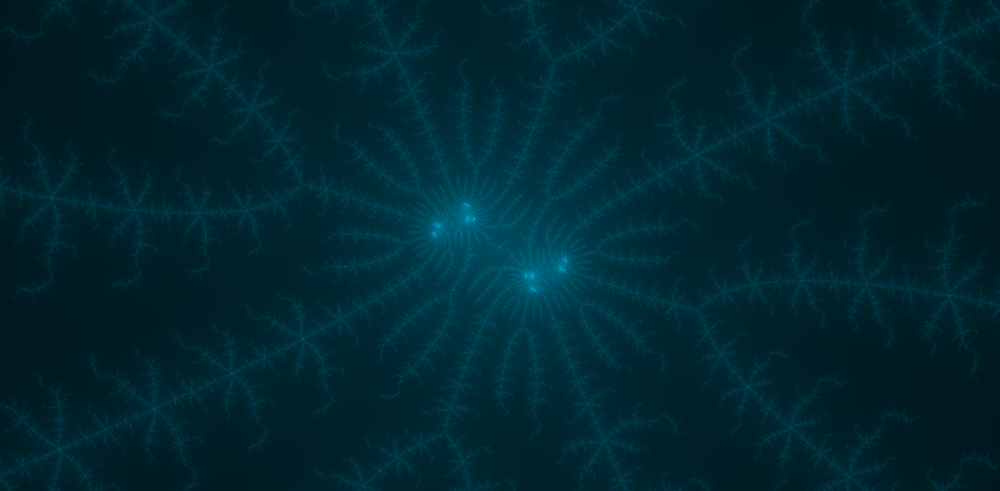

# 概要
C言語で構成されたマンデルブロ集合ビューアアプリケーション．
マウスや文字の入力に応じてリアルタイムで描画する．

# 操作
## マウス入力
ホイールで拡大/縮小，クリックで移動．
## 画面上部のメニュー
- ファイル
  * インポート  
    下記「エクスポート」で出力される文字列を入力することで描画内容を設定します
  * エクスポート  
    + 描画内容をコピーする  
      描画に必要なデータを文字列としてコピーします
    + 描画結果をコピーする  
      現在のウィンドウをそのままコピーします
  * 画像として保存する
  * 終了する
- 初期化
  * 全ての初期化
  * 描画範囲の初期化
  * 配色の初期化
- 設定
  * 配色  
    色の付け方を設定します
  * 最大計算回数  
    収束/発散の判定を行うループ回数の上限を設定します

# ギャラリー

# 環境
Windows OS

# ノート
計算量はウィンドウサイズに依存します．

# 著者
* GitHub : [TOMOQ1024](https://github.com/TOMOQ1024)
* Twitter : [@TOMOQ8192](https://twitter.com/TOMOQ8192)

# ライセンス
This application is released under the MIT License, see [LICENSE](/LICENSE).
